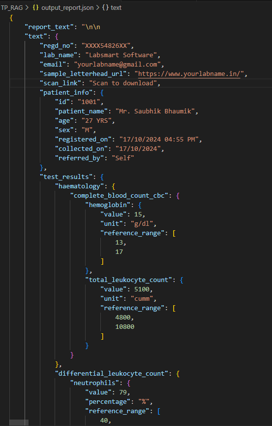
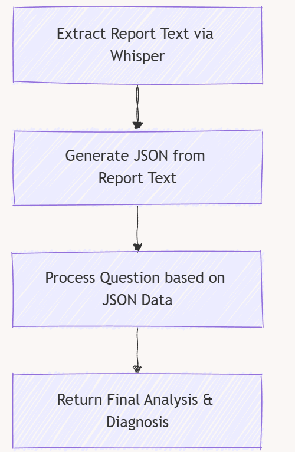

Medical Document Analysis Pipeline
===================================

The **Medical Document Analysis Pipeline** is designed to extract and process information from medical reports, interpret the data, and generate insights and recommendations. This pipeline combines advanced technologies for text extraction, natural language processing, and medical knowledge, allowing it to work with structured medical reports in a variety of formats (e.g., PDFs). The pipeline can analyze the text from medical documents and then use an LLM (Large Language Model) to generate insights based on the data.

Pipeline Overview
-----------------

This pipeline consists of several key stages:

1. **Text Extraction Using Whisperer**:
   - The first step is to extract text from a medical document (e.g., a PDF report) using an external service like **LLMWhisperer**. This step converts unstructured medical report data into machine-readable text.

2. **Data Structuring**:
   - Once the text is extracted, a **PromptTemplate** is used to instruct an LLM to convert the extracted text into a structured **JSON** format. This is essential for organizing the raw data into a format that can be easily queried and analyzed.

3. **Data Analysis and Interpretation**:
   - The structured **JSON** data is then passed to an LLM model for further analysis. Based on the provided JSON data, the model answers specific questions related to the patient's medical information. These questions can include:
     - Summarizing key findings
     - Providing possible diagnoses or differential diagnoses
     - Offering recommendations for further tests or treatments

4. **Final Output**:
   - The final output is a text-based response generated by the LLM that explains the analysis of the medical data and provides insights based on standard medical knowledge.

How the Code Works
-------------------

.. code-block:: python

   #client = LLMWhispererClientV2()
   # Provide the base URL and API key explicitly
   def interpret_json(file):
       client = LLMWhispererClientV2(base_url="https://llmwhisperer-api.us-central.unstract.com/api/v2", api_key="")
       
       def llmwhisper(file_path1):
           whisper = client.whisper(
               file_path=file_path1, 
               wait_for_completion=True,
               wait_timeout=200
           )
           return whisper['extraction']['result_text']
   
       from langchain.prompts import PromptTemplate
       from langchain.chains import LLMChain
   
       # Initialize the LLM
       llm = ChatOllama(model='llama3.2')
   
       # Define the prompt to convert medical report into structured JSON format
       prompt = PromptTemplate(
           input_variables=["report_text"],
           template="""
       You are a medical data parser. Convert the following medical report into a structured JSON format. 
   
       Report Text:
       {report_text}
   
       Ensure the JSON is well-formatted and includes all information from the report.
   
       Output only json no text.
       """
       )
   
       # Create the LLM chain
       chain = LLMChain(llm=llm, prompt=prompt, output_parser=JsonOutputParser())
   
       # Extract text from the provided medical file (e.g., a PDF)
       extracted_report_text = llmwhisper(file)
   
       # Run the LLM chain to convert extracted text into structured JSON
       response = chain.invoke({"report_text": extracted_report_text})
   
       # Define the prompt for asking questions based on the structured JSON data
       prompt = PromptTemplate(
           input_variables=["json_data", "question"],
           template="""
       You are an experienced and compassionate medical professional that can answer questions based on structured data in JSON format. You are great at answering medical questions, explaining symptoms, treatments, and 
       diagnoses in a clear and empathetic way. 
   
       Here is the provided data:
       {json_data}
   
       Now, please answer the following question based on the data:
       {question}
       """
       )
   
       # Create the LLM chain to analyze the JSON data and answer the question
       chain = LLMChain(llm=llm, prompt=prompt)
   
       # Define a medical question to ask based on the provided JSON data
          question = "Based on the provided medical report data in JSON format, analyze and interpret the details of the patient's medical information, including any relevant medical history, test results, and 
          observations. Summarize the key findings, explain their significance, and provide a possible diagnosis or a set of differential diagnoses based on standard medical knowledge. Include any recommendations for 
          further tests or treatments if applicable."
   
       # Run the chain with the JSON data and the medical question
       response1 = chain.invoke({"json_data": response, "question": question})
   
       # Return the final analysis and recommendations
       return response1['text']
