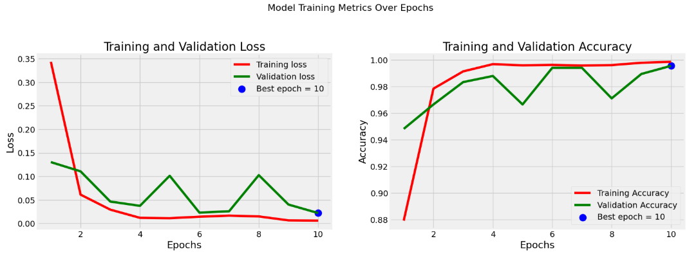

Medical diagnoses – Brain cancer prediction
===========================================

Overview of the project
-----------------------

This project focuses on developing a deep learning-based solution for predicting the type of brain cancer from MRI images. The primary objective is to create an efficient model to assist medical professionals in diagnosing and categorizing brain tumors.

For this project, we are using *Xception*, a state-of-the-art deep convolutional neural network architecture known for its efficiency and high performance in image classification tasks. Xception utilizes depthwise separable convolutions, which significantly reduce computational cost while maintaining accuracy, making it an ideal choice for processing medical images.

Pipeline 
--------

Dataset
-------

*Description*

We are using a curated dataset of MRI images from Kaggle.

To improve model performance and generalizability, we are using preprocessing techniques such as resizing, normalization, and data augmentation.

In this project, we have 4 classes: *meningioma, **glioma, **pituitary, and **notumor*. Below is the number of samples in each class and their distribution:

*For training*:

*For testing*:

Next, we will split the test data into test and validation sets with a split ratio of 0.5.

Preprocessing
-------------

To preprocess image data for training, validation, and testing, we are using the class ImageDataGenerator from TensorFlow/Keras. 

- The batch size is set to 32 for training and validation datasets, while the test dataset uses a smaller batch size of 16. 
- The target image size is defined as (299, 299), which matches the input requirements for the Xception model.

Here are some samples from preprocessed data:

Model Architecture
-------------------

The Xception model is a deep convolutional neural network architecture that builds upon the concept of depthwise separable convolutions. It is an extension of the Inception architecture and aims to improve efficiency and performance. 

*Xception (Extreme Inception)* replaces standard convolutions with depthwise separable convolutions, where each filter is applied separately to the input channels, significantly reducing computational complexity. This allows for better utilization of parameters while maintaining strong feature extraction capabilities, making it particularly effective for tasks like image classification, object detection, and more.

*Building the model*:

We opted for the Adam optimizer with a learning rate of 0.001.

Training the Model
------------------

The training process involves teaching the model to improve its performance over multiple iterations. 

- The model is presented with data, learns from it by adjusting its internal parameters, and evaluates its performance periodically. 
- During training, it makes predictions and compares them to the correct outcomes, adjusting its parameters to reduce errors.
- The process is repeated for several cycles, with the model also being tested on separate data to ensure it generalizes well.

Throughout the training, metrics like *accuracy* and *loss* are tracked, allowing for adjustments to improve the model's performance and avoid overfitting.

Results
-------

The results show that the model performed exceptionally well on the validation dataset, achieving a validation accuracy of *0.9954*. 

This high accuracy indicates that the model is able to correctly predict nearly *99.5%* of the samples in the validation set, suggesting it generalizes effectively and performs the task with great precision. Such a strong validation accuracy reflects the model's ability to capture relevant patterns in the data and its overall effectiveness in making accurate predictions on unseen examples. 

However, further testing on a separate test set would provide additional confirmation of the model's robustness.

*Confusion Matrix*:

Evaluating the Model
--------------------

Evaluating a model involves testing its performance on a separate dataset that it hasn't seen during training.

.. image:: images/Evaluating_1.png
   :alt: evaluation result
   :align: center
   :width: 32%

.. image:: images/Evaluating_2.png
   :alt: evaluation result
   :align: center
   :width: 42%

